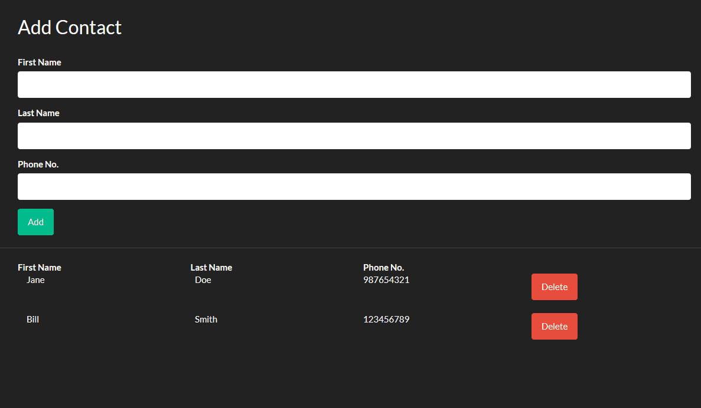

# MEAN stack practice
Based on Edureka tutorial: https://www.youtube.com/watch?v=wtIvu085uU0
(Some changes had to be made - modules were explicitly added to Angular's app.module)
# Demo:

# To run:
Startup mongodb (mongod.exe)
Start node (nodemon)
Start angular (npm start in client folder)